# BrainPower 
Click [here](https://kkwong44.github.io/brainpower/index.html) to access live site.

This project was completed, published and shared in Github.

*Screenshot - Mockup on BrainPower Website, generated from [Multi Device Website Mockup Generator](https://techsini.com/multi-mockup/index.php)*

___

## Objectives

BrainPower is a site provides games to test the strength of human brain. It can use to train and improve the player's brain perfomance.

The target audients will be players that wish to test, train and improve their brain perfomace.

The initial project of this site is to create a game to test the player's memory. As the site evolve, additional games can be added to test varies part of the brain.

### Business Goals
* Develope games that can test the brian performace
* Allow players to train their brain
* Making the game enjoyable to play

### User Goals
* Test their performace
* Challenge themself to improve their performace

___

## User Experience Design

### Initial Design
Based on the objectives, a game is to be developed to test the player's memory by asking the player to memorise and submit a random number that was shown on the screen. Wireframe was used to create the initial design of the game. The following are the basic structure and functions that will be used to run the game.

*Wireframe - Game Page*

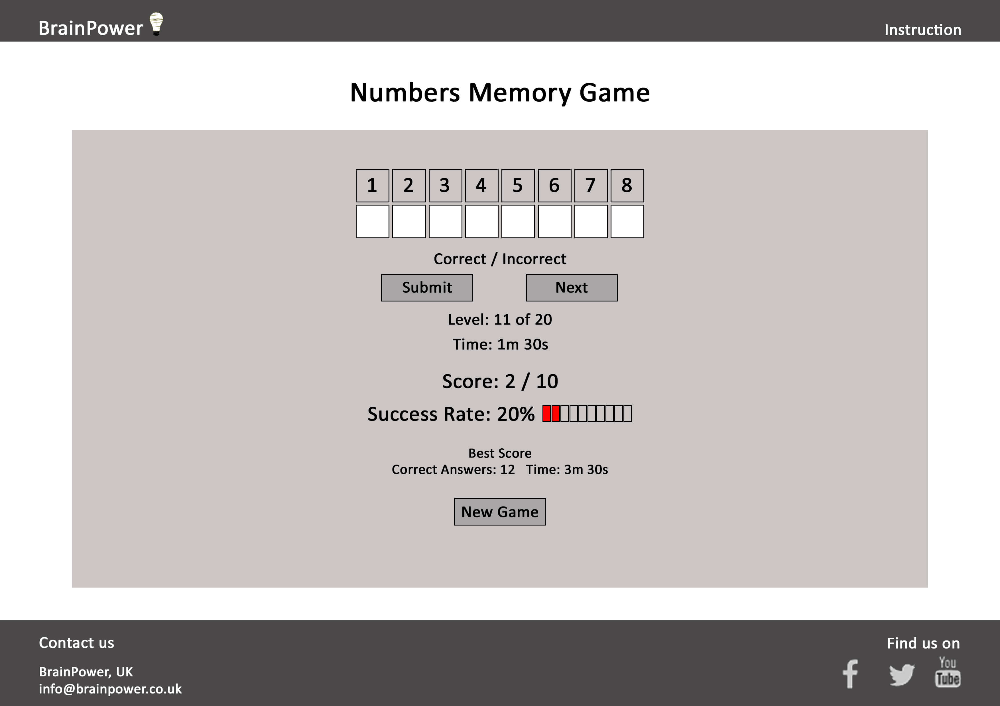

*Basic Structure and Functions For The Memory Game*

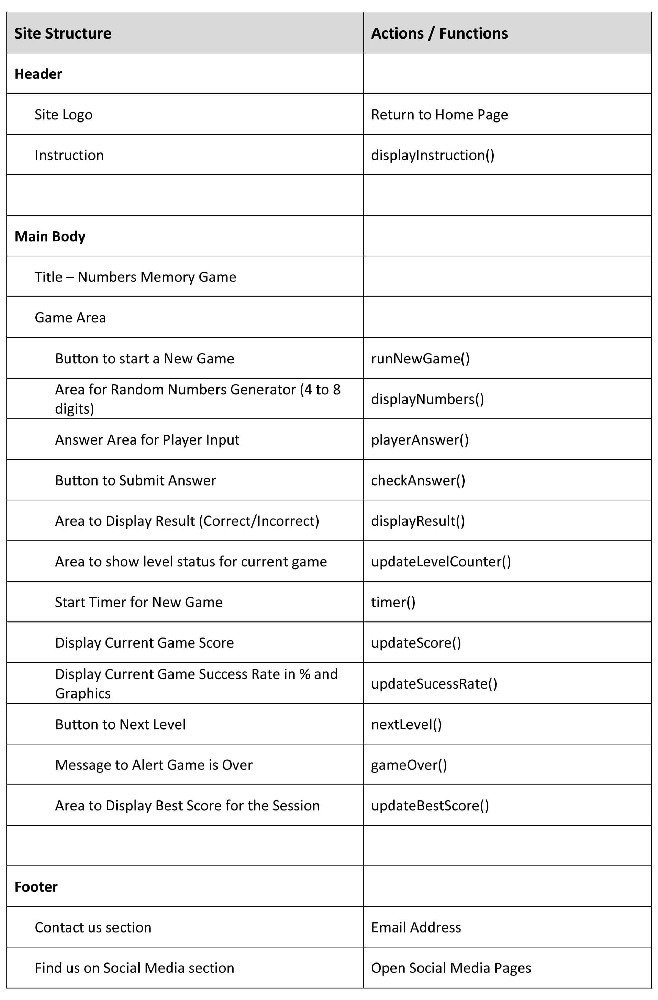

From the initial design it shows that the site can be broken down to the following areas.

1. Common Components section (Header and Footer)
2. Access to Instruction
3. Game Title
4. Game Area

### *Common Components*
The following list is the common components that can be used across the website:
* All pages contain a logo "BrainPower" and an image logo on the left of the header
* A button to access to the game's instruction is loacted on the right of the header
* All Pages contain a footer. It has 2 sections, Contact us with an email link and links to Find us on Social Media
* When the email link is clicked. Local email client will be opened with an address to BrainPower, UK
* Each social media link will be opened in a new window when its clicked

### *Access to Instruction*
Each game can have it's own instruction and can be accessed by clicking on the instruction button. A message box with instruction will display and sit on top of the page.

### *Game Title*
For this project there is only one game and the title for this game is "Numbers Memory Game".

### *Game Area*
For this project there is only one game and the layout in the game area is for the "Numbers Memory Game".

### Additional Design
During the development it was decided that a home page should be added for the "Numbers Memory Game". This page provides information and instruction to the game. A link from the header and a button at the bottom of the game area allow the player to access the game page.

*Screenshot - Homepage*

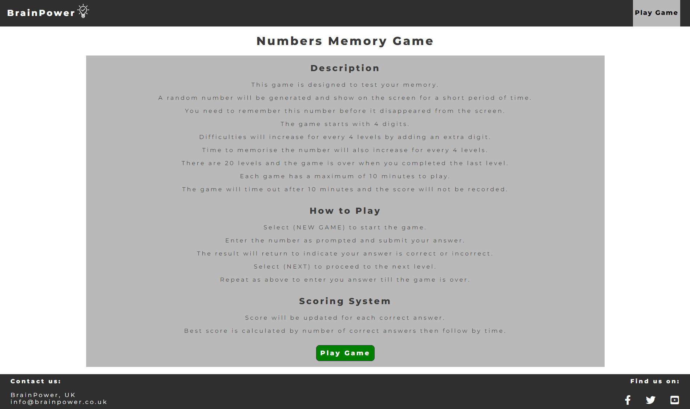

### Responsive and Accessibility
The website has been developed to be used by as many users as possible and as many devices as possible.

* The site is aim to run on all devices
* Accessibility has been incorporated into the design
___

## Features

### Header
All pages have the same header format. This section allow user to navigate the site.

On the left it shows the company name and its image logo. On the right there is a button like feature to navigate to different part of the site.

Features on this section:
* Company Name on the left as part of the logo
* An image of the logo next to the company name
* Both company name and logo will redirect to the home page when these are clicked by the user
* A button like element on the right will change its background color when hover over this element and restore it's original color when hover is removed
* For home page, the link is to direct to the Game Page
* For game page, the link is to access the instruction modal box

*Screenshot - Header on Home Page*

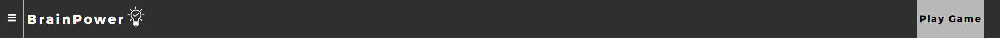

*Screenshot - Header on Game Page*

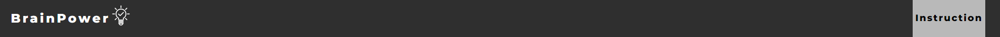

#### Responsive
User can access to site via different devices.

The site is designed to response and give the best display on different screen width.

* When the screen width is below 768px, Play Game button on home page move below company name
* When the screen width is below 768px, Instruction button on game page move below company name

*Screenshot - Header on home page for small width devices*

*Screenshot - Header on game page for small width devices*

### Footer
All Pages have the same footer.

The footer section allows the user find out more information about the company.

The layout is separated in 2 sections, company contact details and follows the company in social media.

Features on this section:
* Contact details are on the left with an email link
* Find us on social media on the right
* The email link and the social media icons will be darkened when hover
* Email client will be opened when clicked
* A new window will be opened for each social media when clicked

*Screenshot - Footer for all pages*

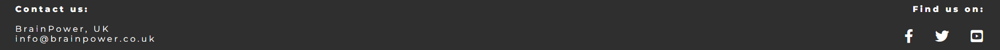

#### Responsive
User can access to site via different devices.

The site is designed to response and give the best display on different screen width.

* When the screen width is below 768px, the 2 sections will stack into a column

*Screenshot - Footer contact us section stack on top of find us on section*

### Home Page
The description and instruction are listed on this page. Links are provide to access to the game area.

Player can read the decription of the game and instruction on how to play the game. System for calculating the score also provided. Player can access to the game are by clicking the "Play Game" button on the header or the button on the bottom of the page.

Features on this page
* Description, Instruction and Scoring System
* The numbers in description are dynamic and they are from session storage
* Anchor link to the game area from the header
* Button Link to the game area via (Play Game) button

*Screenshot - Homepage Features*

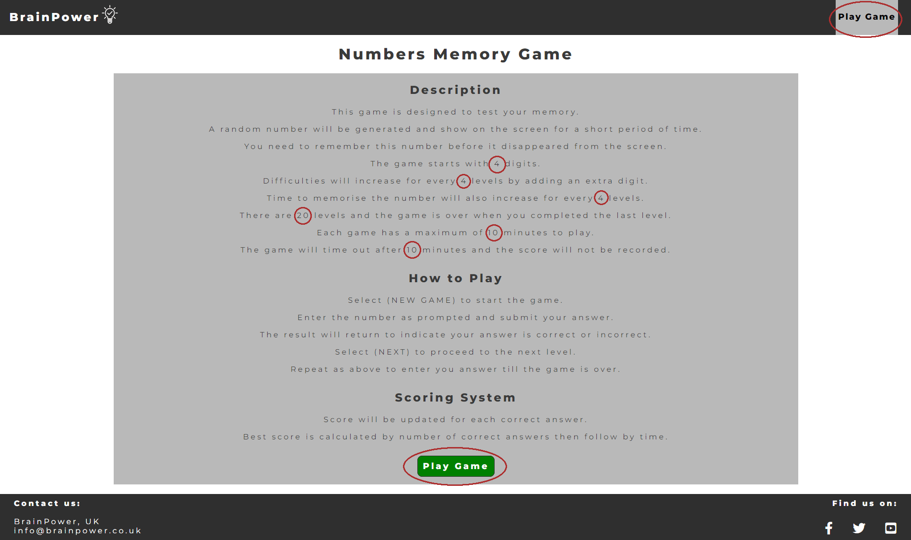

### Game Page
The layout on this page is for the "Numbers Memory Game". It is designed to test the player's memory by asking the player to submit the random number that was briefly shown on the screen. There are 20 levels and the game starts with 4 digits number. Difficulties will increase for every 4 levels completed by an extra digit and the game finishes with 8 digits number. Time to memorise the number also increase by 0.5 seconds for every 4 levels completed. The maximum time to complete the game is set to 10 minutes.

Player is expected to complete 20 levels within 10 minutes. For each level a random number will briefly display on the screen then ask the player to submit the same number. Each answer submitted will be checked and varified. The answer either correct and incorrect. Score will be updated accordingly and the player then can proceed to the next level till the end of the game. The final score and time used will be display on the screen. The player can now play a new game to improve their scores.

Features on this page
* Player can access to the game's instruction by clicking the Instruction button located on the header.
* Game's Title
* Game's Area
* Square containers to display the random number
* Square containers to accept player's answer
* A message area
* Level Counter
* Timer
* Score Counter
* Success Rate in percentage and in graphic representation
* Best Score
* Buttons to start a new game, submit the answer and proceed to the next level.
* Game Over Message Box

### *Game's Instruction*
*Screenshot - Game's Instruction Feature*

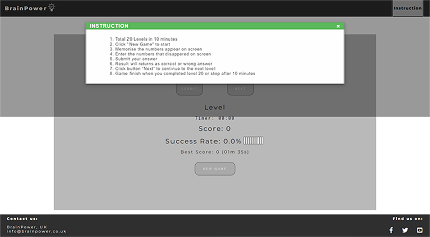

Player clicked on the Instruction and it display on top of the game. Player can close the message box by cliking on the X or anywhere in the shaded area.

### *Game's Title and Area*
*Screenshot - Game's Title and Area*

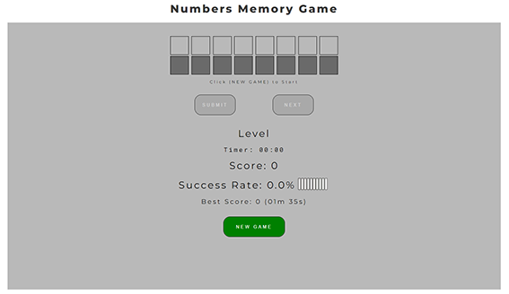

Game's title is on the top and the game's area is in the gray area.

### *Square Containers for the numbers*
*Screenshot - Square Containers To Display Number and Accept Player's Answer*

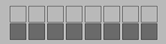

Top row is for the random computer generated number. Bottom row is for player to submit the answer.

*Screenshot - A random number generated by the game*

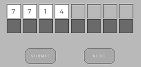

*Screenshot - The game ask the player to submit the number*

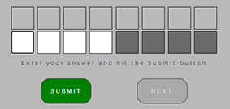

*Screenshot - Player entered an invalid character in the second digit*

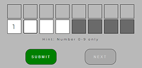

*Screenshot - Player submmited the correct number*

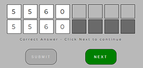

*Screenshot - Player submitted a wrong number*

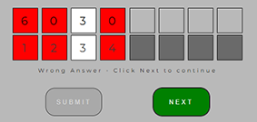

### *Message Area*
*Screenshot - Message Area*

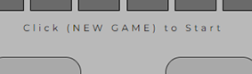

Messages can be anyone of the following:
* Click (NEW GAME) to start
* Enter your answer and hit the Submit button
* Hint: Number 0-9 only
* Correct Answer - Click Next to continue
* Wrong Answer - Click Next to continue

### *Game's Status and Buttons*
*Screenshot - Game's Status Area and Buttons*

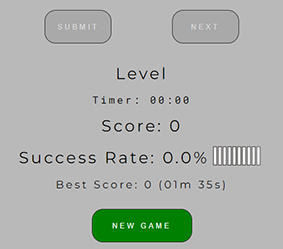

The game's status area holds the information about the game and it contains the following:
* Level Counter - Increment by 1 for each completed level.
* Timer - Start as soon as the game start and the game run for maximun 10 minutes.
* Score - Increment by 1 for each correct answer.
* Success Rate - Represent by percenatge and bar chart.
* Best Score - This score is store locally and updated when the score has been beaten.
* Button for (NEW GAME) - To start a new game.
* Button for (SUBMIT) - To submit player's answer.
* Button for (NEXT) - To continue to the next level.

During the game only one button will be enabled at a time.

### *Game Over Message Box*
A message box will appear on top of the game when the game is finished. There are 4 possible messages.
* Game Over with Best Score
* Game Over with Equal Score but finished in a quicker time
* Game Over with Score
* Game Over when Timeout

*Screenshot - Game Over With Best Score*

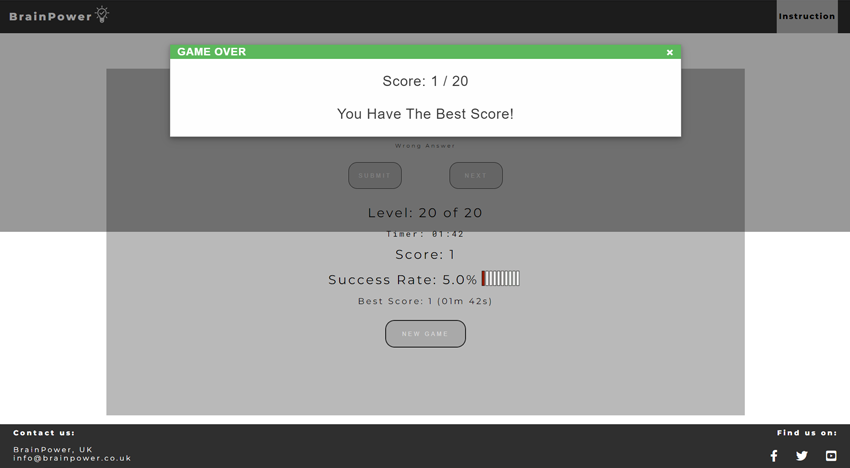

*Screenshot - Game Over with Equal Score but finished in a quicker time*

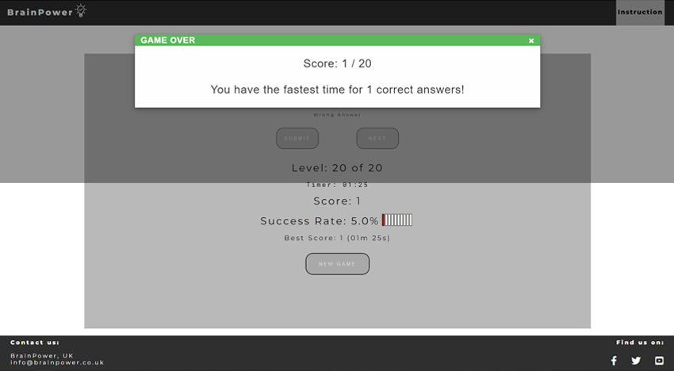

*Screenshot - Game Over with Score*

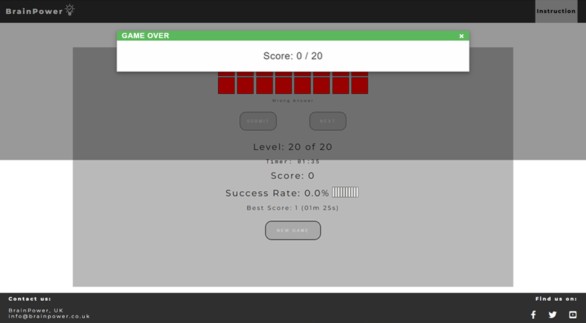

*Screenshot - Game Over when Timeout*

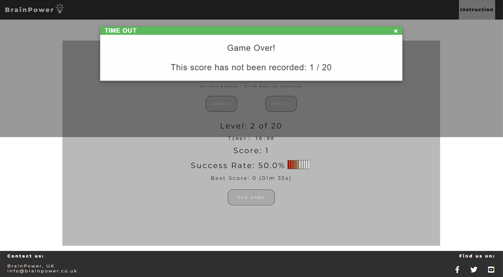

___

## Future Features