# BrainPower 
Click [here](https://kkwong44.github.io/brainpower/index.html) to access live site.

This project was completed, published and shared in Github.

*Screenshot - Mockup on BrainPower Website, generated from [Multi Device Website Mockup Generator](https://techsini.com/multi-mockup/index.php)*

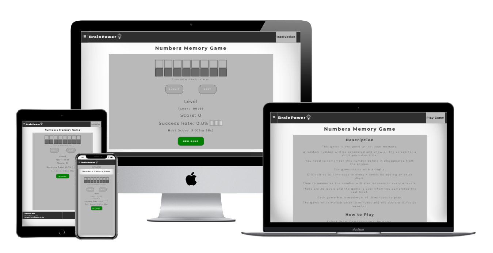
___

## Objectives

BrainPower is a site provides games to test the strength of human brain. It can use to train and improve the player's brain performance.

The target audients will be players that wish to test, train and improve their brain performance.

The initial project of this site is to create a game to test the player's memory. As the site evolve, additional games can be added to test varies part of the brain.

### Business Goals
* Develop games that can test the brain performance
* Allow players to train their brain
* Making the game enjoyable to play

### User Goals
* Test their performance
* Challenge themself to improve their performance

___

## User Experience Design

### Initial Design
Based on the objectives, a game is to be developed to test the player's memory by asking the player to memorise and submit a random number that was shown on the screen. Wireframe was used to create the initial design of the game. The following are the basic structure and functions that will be used to run the game.

*Wireframe - Game Page*

*Basic Structure and Functions For The Memory Game*

From the initial design it shows that the site can be broken down to the following areas.

1. Common Components section (Header and Footer)
2. Access to Instruction
3. Game Title
4. Game Area

### *Common Components*
The following list is the common components that can be used across the website:
* All pages contain a logo "BrainPower" and an image logo on the left of the header
* A button to access to the game's instruction is located on the right of the header
* All Pages contain a footer. It has 2 sections, Contact us with an email link and links to Find us on Social Media
* When the email link is clicked. Local email client will be opened with an address to BrainPower, UK
* Each social media link will be opened in a new window when its clicked

### *Access to Instruction*
Each game can have it's own instruction and can be accessed by clicking on the instruction button. A message box with instruction will display and sit on top of the page.

### *Game Title*
For this project there is only one game and the title for this game is "Numbers Memory Game".

### *Game Area*
For this project there is only one game and the layout in the game area is for the "Numbers Memory Game".

### Additional Design
During the development it was decided that a home page should be added for the "Numbers Memory Game". This page provides information and instruction to the game. A link from the header and a button at the bottom of the game area allow the player to access the game page.

*Screenshot - Homepage*

### Responsive and Accessibility
The website has been developed to be used by as many users as possible and as many devices as possible.

* The site is aim to run on all devices
* Accessibility has been incorporated into the design
___

## Features

### Header
All pages have the same header format. This section allow user to navigate the site.

On the left it shows the company name and its image logo. On the right there is a button like feature to navigate to different part of the site.

Features on this section:
* Company Name on the left as part of the logo
* An image of the logo next to the company name
* Both company name and logo will redirect to the home page when these are clicked by the user
* A button like element on the right will change its background color when hover over this element and restore it's original color when hover is removed
* For home page, the link is to direct to the Game Page
* For game page, the link is to access the instruction modal box

*Screenshot - Header on Home Page*

*Screenshot - Header on Game Page*

#### Responsive
User can access to site via different devices.

The site is designed to response and give the best display on different screen width.

* When the screen width is below 768px, Play Game button on home page move below company name
* When the screen width is below 768px, Instruction button on game page move below company name

*Screenshot - Header on home page for small width devices*

*Screenshot - Header on game page for small width devices*

### Footer
All Pages have the same footer.

The footer section allows the user find out more information about the company.

The layout is separated in 2 sections, company contact details and follows the company in social media.

Features on this section:
* Contact details are on the left with an email link
* Find us on social media on the right
* The email link and the social media icons will be darkened when hover
* Email client will be opened when clicked
* A new window will be opened for each social media when clicked

*Screenshot - Footer for all pages*

#### Responsive
User can access to site via different devices.

The site is designed to response and give the best display on different screen width.

* When the screen width is below 768px, the 2 sections will stack into a column

*Screenshot - Footer contact us section stack on top of find us on section*

### Home Page
The description and instruction are listed on this page. Links are provide to access to the game area.

Player can read the description of the game and instruction on how to play the game. System for calculating the score also provided. Player can access to the game are by clicking the "Play Game" button on the header or the button on the bottom of the page.

Features on this page
* Description, Instruction and Scoring System
* The numbers in description are dynamic and they are from session storage
* Anchor link to the game area from the header
* Button Link to the game area via (Play Game) button

*Screenshot - Homepage Features*

### Game Page
The layout on this page is for the "Numbers Memory Game". It is designed to test the player's memory by asking the player to submit the random number that was briefly shown on the screen. There are 20 levels and the game start with 4 digits number. Difficulties will increase for every 4 levels completed by an extra digit and the game finishes with 8 digits number. Time to memorise the number also increase by 0.5 seconds for every 4 levels completed. The maximum time to complete the game is set to 10 minutes.

Player is expected to complete 20 levels within 10 minutes. For each level a random number will briefly display on the screen then ask the player to submit the same number. Each answer submitted will be checked and verified. The answer either correct and incorrect. Score will be updated accordingly and the player then can proceed to the next level till the end of the game. The final score and time used will be display on the screen. The player can now play a new game to improve their scores.

Features on this page
* The game use Local and Session storages to hold constants and variables.
* Player can access to the game's instruction by clicking the Instruction button located on the header.
* Game's Title
* Game's Area
* Square containers to display the random number
* Square containers to accept player's answer
* A message area
* Level Counter
* Timer
* Score Counter
* Success Rate in percentage and in graphic representation
* Best Score
* Buttons to start a new game, submit the answer and proceed to the next level.
* Game Over Message Box

### *Local and Session storage values*
Both local and session storage are used to run the game. The constants and variables are declared in the script-index.js and can be changed.

**Local Storage**

This game use local storage to store the best score on device. There are 2 variables and default values are set as below. These values will be updated when the score has been beaten. The default values can be reset when local storage has been cleared.

* bestScoreTime = 59:59
* bestScore = 0

**Session Storage**

The session storage is used to store constants and variables for the game. These default values always reset to it's original values when the game start. 

Constants
* maxDigit = 8 (maximum number of digits)
* minDigit = 4 (Start the game with minimum number of digits)
* maxLevel= 20 (maximum number of levels)
* gameTimeInMinute = 10 (maximum time game in minutes)
* gameInterval = 4 (Number of levels to change difficulties)
* initialMemoryTime = 1500 (Start the game with 1.5s to memorise the number)

Variables
* numDigits = 4 (number of digit changes according to the difficulties)
* memoryTime = 1500 (time to memorise the number changes according to the difficulties)
* score = 0 (score for the game)
* miniuteTimer = 0 (time in minutes used in the game)
* secondTimer = 0 (time in seconds used in the game)

### *Game's Instruction*
*Screenshot - Game's Instruction Feature*

Player clicked on the Instruction and it display on top of the game. Player can close the message box by clicking on the X or anywhere in the shaded area.

### *Game's Title and Area*
*Screenshot - Game's Title and Area*

Game's title is on the top and the game's area is in the grey area.

### *Square Containers for the numbers*
*Screenshot - Square Containers To Display Number and Accept Player's Answer*

Top row is for the random computer generated number. Bottom row is for player to submit the answer.

*Screenshot - A random number generated by the game*

*Screenshot - The game asks the player to submit the number*

*Screenshot - Player entered an invalid character in the second digit*

*Screenshot - Player submitted the correct number*

*Screenshot - Player submitted a wrong number*

### *Message Area*
*Screenshot - Message Area*

Messages can be anyone of the following:
* Click (NEW GAME) to start
* Enter your answer and hit the Submit button
* Hint: Number 0-9 only
* Correct Answer - Click Next to continue
* Wrong Answer - Click Next to continue

### *Game's Status and Buttons*
*Screenshot - Game's Status Area and Buttons*

The game's status area holds the information about the game and it contains the following:
* Level Counter - Increment by 1 for each completed level.
* Timer - Start as soon as the game start and the game run for maximum 10 minutes.
* Score - Increment by 1 for each correct answer.
* Success Rate - Represent by percentage and bar chart.
* Best Score - This score is store locally and updated when the score has been beaten.
* Button for (NEW GAME) - To start a new game.
* Button for (SUBMIT) - To submit player's answer.
* Button for (NEXT) - To continue to the next level.

During the game only one button will be enabled at a time.

### *Level Counter and Success Rate*
Success Rate is calculated by number of correct answers against the levels completed. The bar chart has 10 bars and each bar is represent as follow:
* 0% (no bar)
* 0% > rate <= 10% (1 bar)
* 10% > rate <= 20% (2 bars)
* 20% > rate <= 30% (3 bars)
* 30% > rate <= 40% (4 bars)
* 44% > rate <= 50% (5 bars)
* 50% > rate <= 60% (6 bars)
* 60% > rate <= 70% (7 bars)
* 70% > rate <= 80% (8 bars)
* 80% > rate <= 90% (9 bars)
* 90% > rate <= 100% (10 bars)

*Screenshots - Samples of Level Counter and Success Rates*

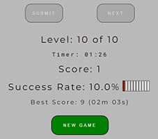
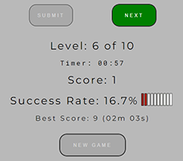
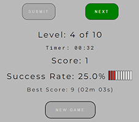

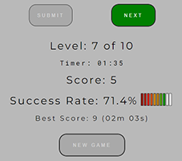

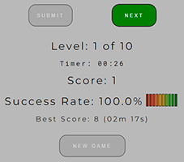

### *Game Over Message Box*
A message box will appear on top of the game when the game is finished. There are 4 possible messages.
* Game Over with Best Score
* Game Over with Equal Score but finished in a quicker time
* Game Over with Score
* Game Over when Timeout

*Screenshot - Game Over With Best Score*

*Screenshot - Game Over with Equal Score but finished in a quicker time*

*Screenshot - Game Over with Score*

*Screenshot - Game Over when Timeout*

___

## Future Features
This site can evolve and more games can be added to the site.

The "Numbers Memory Game" can be extended to test more than 8 digits but the size and layout of the squares need to adjust to cater for the change.

New feature to allow player to select difficulties of the game.

Create player account to store game history.
___

## Testing

**Unit Testing**

Unit testing was used to test individual feature of the game. It tests each feature to ensure the operation is functioning as expected.

Click [here](readme/testing/report-unit-testing.md) for the unit testing report.

**Functional Testing**

The functional testing is to ensure the site and the game is behave as expected.

Click [here](readme/testing/report-functional-testing.md) for the functional testing report.
___

## Validator Testing
Validator testing is used to validate codes that are legally written and to identify any possible errors. This can be done by using online automated testing tools to scan through the codes.
The tools used for this project are
* W3C Markup Validation Service to validate HTML - https://validator.w3.org/
* W3C CSS Validation Service to validate CSS - https://jigsaw.w3.org/css-validator/

The code can be copied and paste directly into the validator to perform the test. A report will be generated with the test results where it identified the errors. The validator will show passed when the code is free of error.

### Validation Reports
The following reports show all HTML pages and CSS code have passed the test.

*Home Page - index.html*

*Game Page - game.html*

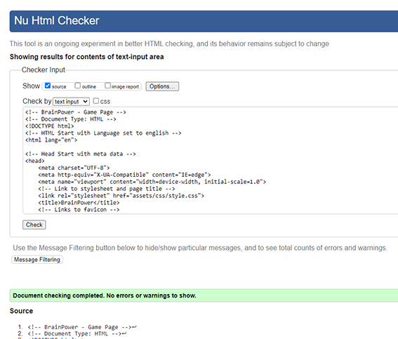

*Error 404 Page - 404.html*

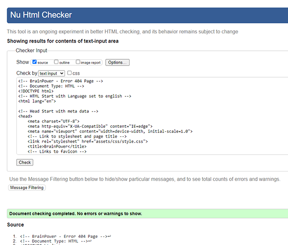

*Stylesheet - style.css*

___

## Performance and Accessibility Testing
Lighthouse is a tool in Chrome Development Tools that allows developer to test their website. Performance and Accessibility are two of the tests carried out by Lighthouse and it can identify where you can improve the performance and accessibility.

From the lighthouse reports at below, it shows the site perform well. The site was physically tested on several devices from desktops, tablets and mobile phones. The performance on these devices were operated normally and without lagging.

*Lighthouse Report on index page*

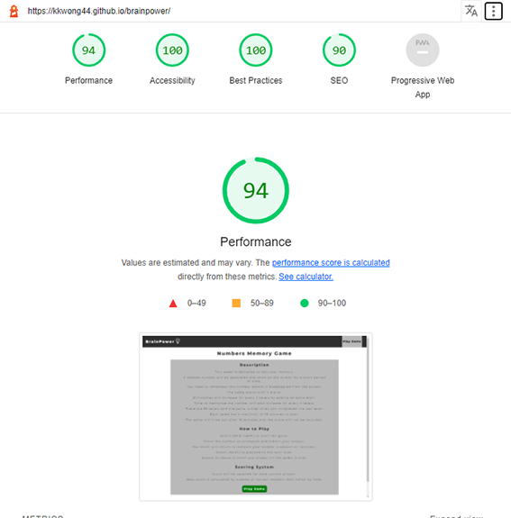

*Lighthouse Report on game page*

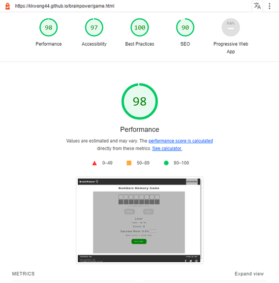
___

## Unfixed Bugs
* Currently, the layout of the number squares is designed for up to 8 digits on mobile devices. This is acceptable for current scope as maximum digit is set to 8 but need to refine if changing the scope.
___

## Deployment
### Tools
* GitHub is a code hosting platform for version control and collaboration
* Gitpod is a ready-to-code developer environment

### Development processes

* All the development works are carried out in Gitpod
* Create a repository in Github through Gitpod
* Start the project from a boilerplate written by Code Institute. The full template can be copied from [here](https://github.com/Code-Institute-Org/gitpod-full-template)

    **Repeat the following until project completion**

* Developing your site, save your project in your Gitpod workspaces
* Use git add command to add files to local repository
* Use git commit command to commit the changes to local repository

### Deployment to Github Pages

* Use git push to upload local repository content (Gitpod) to a remote repository (Github)

    **The published site link can be found from your Github repository setting.**

* Select setting from your github repository
* Select Pages on the left hand side menu as shown below
* Under the Source section, you need to select main from Branch in order to publish the site
* You can suspend the published site by selecting none from Branch in the source section

In order to commit any new changes to the live site, always perform git push to upload the latest version of the development code to the remote repository.

*Screenshot - Github Pages*

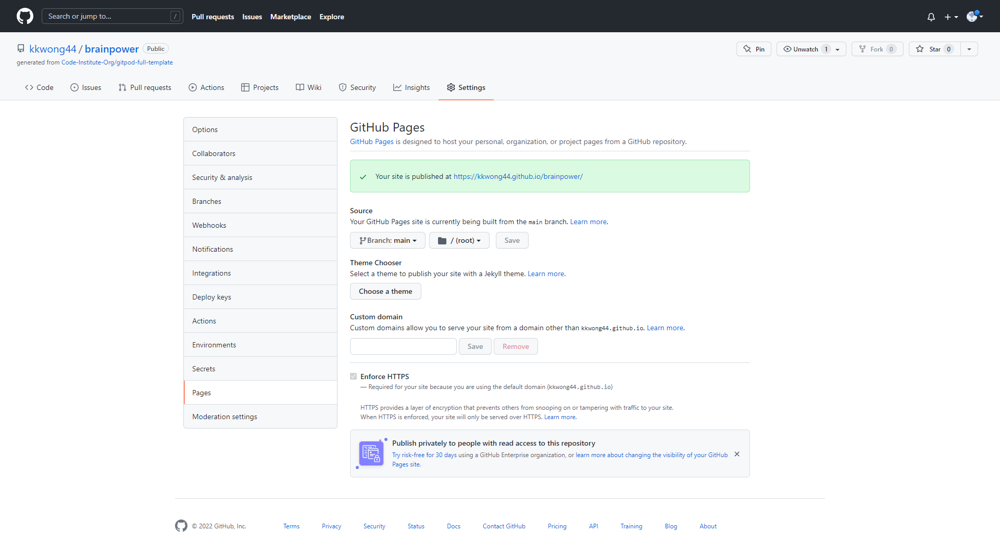

The live site for this project is published under [https://kkwong44.github.io/brainpower/](https://kkwong44.github.io/brainpower/)

***You can use GitHub Desktop to clone and fork repositories that exist on GitHub.***

Click [here](https://docs.github.com/en/desktop/contributing-and-collaborating-using-github-desktop/adding-and-cloning-repositories/cloning-and-forking-repositories-from-github-desktop) for more information on Cloning and forking repositories from GitHub Desktop.
___

## Credits
### Content
The basic structure of the pages are based on the Cappadocia Tour project i.e  page header and footer. Some javascript logics are inspired from the Love Maths project.

The footer icons for the Social Media are from:

* Font Awesome website - [https://fontawesome.com/](https://fontawesome.com/)

Website favicon was generated from:

* favicon - [https://favicon.io/](https://favicon.io/)

The modal box technique is based on the example from:

* W3schools - [https://www.w3schools.com/howto/howto_css_modals.asp](https://www.w3schools.com/howto/howto_css_modals.asp)

There are number of window objects and DOM events were used in the project. For example, locatStorage(), sessionStorage(), setTimeout(), setInterval(), focusout, mouseover, mouseout etc.

The information and usage for all the above methods were from W3Schools website.

* W3schools - [https://www.w3schools.com](https://www.w3schools.com)

The following websites also used for research and development on objects, events and methods in coding javascript.

* MDN Web Docs - [https://developer.mozilla.org/en-US/](https://developer.mozilla.org/en-US/)

* stackoverflow - [https://stackoverflow.com/](https://stackoverflow.com/)

### Media
The images used in this website are from the following:

* The image logo has been edited and from [Pixabay.com](https://pixabay.com/)
___
